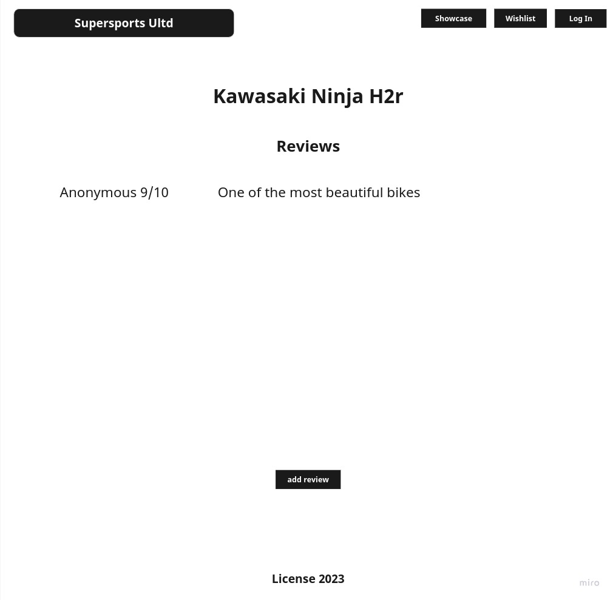

# SuperSports Unlimited

For the utmost clarity when researching the finest supersport bikes in the world. This is meant to be an easy access shopping guide or resource for anyone wanting to browse what the market has to offer. All supersports are new to the market and if there is a bike unlisted feel free to add onto the list. The aim of this app is to make searching a smooth and easy proccess while keeping track of all your favorite rides.

### Technologies
    - HTML
    - CSS
    - Javascript
    - Node
    - Express
    - MongoDB

### User Story

    As a user, i want the ability to...
        - load the homepage with a list of popular bikes
        - click a details section on Each bike for reviews & specifications
        - log in for access to personal wish lists
        - preview the lists as well as leave comments 
        - add bikes to the page

### Wish List

    As a user, i want the ability to...
        - add filters for price, colors & engine capacity
        - be able to filter through different color styles
        - play different videos on the homepage over a logo

### Wireframes

### ERD

